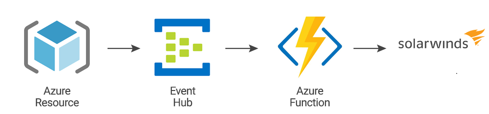

# Stream Logs from Azure Resources to SolarWinds Observability

The [Azure Event Hub](https://docs.microsoft.com/en-us/azure/event-hubs/event-hubs-about) messaging system has built-in support for streaming logs out of a large variety of Azure-hosted resources, such as VMs, load balancers, and more. This makes it a great solution when capturing logs from many sources within your Azure stack. You can use it to forward logs to SolarWinds Observability.

The pipeline can be established:
- [Automatically](doc/automated_setup.md) using PowerShell and ARM template
- [Manually](doc/manual_setup.md)

## Configuration script for configuring logging on Azure virtual machines

- [Linux virtual machines](scripts/LinuxVM/README.md)
- [Windows virtual machines](scripts/WindowsVM/README.md)